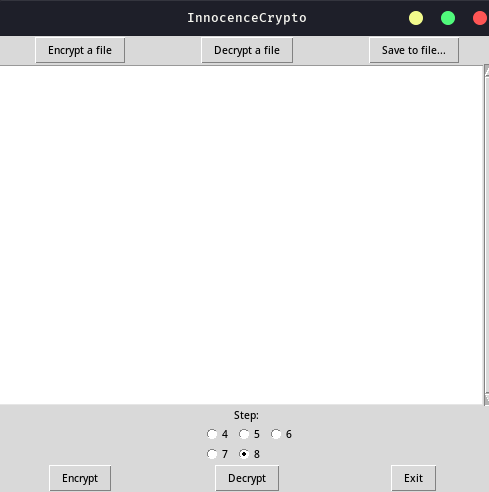

# InnocenceCrypto (The crypto of the naive hacker)


### How to Run

Requires Tk

## Dependencies Install:

    pip3 install -r requirements.txt

##  Help

For the program, just run the following command start in the terminal

```console
    python innocence-crypto.py
```

### How to use

 > Step menu

   * Changes the crypto power.
 
 > Encrypt button:
    
   * Encrypts the text in the textbox.

 > Decrypt button:

   * Decrypts the text in the textbox if it is encrypted with this program.
     (if it was encrypted with the same crypto power).

  > 'Encrypt a file' button:

   * Encrypts a .txt file.

  > 'Decrypt a file' button:

   * Decrypts a .txt file if it is encrypted by the program.
    (if it was encrypted with the same crypto power).

  > 'Save to file...' button:

   * Saves the content of the textbox to a .txt file

## Screen


